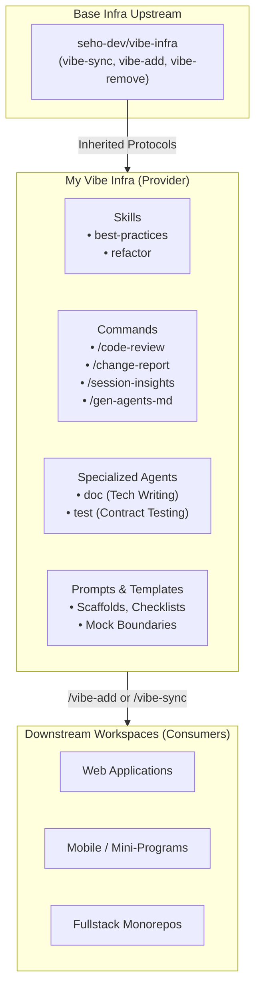

# My Vibe Infra

> **Curated AI Infrastructure Provider for Frontend Engineering, Code Quality, Documentation, and Testing**
>
> [中文文档](README.zh-CN.md) | **English Documentation**

[](https://github.com/seho-dev/vibe-infra)
[](#)
[](https://github.com/seho-dev/my-vibe-infra/actions)
[](LICENSE)

---

## Overview

`my-vibe-infra` is a compliant [vibe-infra](https://github.com/seho-dev/vibe-infra) **Infrastructure Provider Repository** (`role: "provider"`). It distributes production-grade, agent-native engineering capabilities—including specialized Subagents, Slash Commands, Domain Skills, and Battle-Tested Prompts—designed to align AI programming assistants (Claude Code, OpenCode, Antigravity, Cursor, etc.) with real-world engineering standards.



---

## Features

### 1. Domain Skills (`skills/`)

Skills provide deep contextual guardrails loaded dynamically during coding, restructuring, and review:

| Skill | Description | Key Modules & Rules |
| :--- | :--- | :--- |
| **`best-practices`** | Frontend architecture and code quality standards. Mandatory baseline before writing code. | • **Coding Basics & Style**: Mandatory normalization, defensive fallbacks, early returns.<br/>• **Component & Logic**: Separation of UI presentation and business logic.<br/>• **State & Performance**: Minimal state models, avoiding unnecessary re-renders.<br/>• **Checklists**: Ready-to-use review and component checklists. |
| **`refactor`** | Guardrails for safe structural refactoring, migrations, and seam restructuring. | • **Behavior Lock**: Lock behavior with regression tests before moving code.<br/>• **Policy vs. Runtime**: Keep configuration declarative; avoid runtime capability leaks.<br/>• **Declarative Over Imperative**: Prefer top-down data flow; avoid speculative abstractions.<br/>• **Delete Before Toggle**: Eliminate dead paths instead of masking them behind feature flags. |

---

### 2. Slash Commands (`commands/`)

Executable agent prompts enabling standardized engineering workflows:

| Command | Target Audience | Core Focus |
| :--- | :--- | :--- |
| **`/code-review`** | Developers & Tech Leads | **Strict, evidence-driven code review** inspired by Linus Torvalds' engineering philosophy. Prioritizes correctness, regression risk, abstraction fit, and pragmatic complexity over trivial cosmetics. |
| **`/change-report`** | Product Managers & QA | **Zero-jargon change acceptance report**. Translates technical workspace diffs into business-facing impact summaries and concrete verification paths. |
| **`/session-insights`** | Developers & Team Leads | **Multi-worktree session history scanner**. Aggregates session histories across git worktrees to identify cognitive friction, repetitive queries, and optimization opportunities without modifying files. |
| **`/gen-agents-md`** | AI Agents & Projects | **Directory-level `AGENTS.md` generator**. Analyzes modules and generates localized context files to guide AI agents with directory-specific rules while avoiding global context bloat. |

---

### 3. Specialized Subagents (`agents/`)

Custom AI personas configured with specialized system prompts, tool permissions, and scoped responsibilities:

- **`doc` (Documentation Specialist)**:
  - **Scope**: Handles technical documentation, architecture overviews, user feedback reports, and review feedback reports.
  - **Principles**: Concise English, max 3 heading levels, strict table alignment, zero fluff writing.
- **`test` (Testing Specialist)**:
  - **Scope**: Authors unit, logic, component, and integration tests across web and Node applications.
  - **Principles**:
    - **Minimal & Expressive**: Smallest tests that protect real business contracts.
    - **Test Behavior, Not Implementation**: No cosmetic assertions (CSS classes, DOM depth, static copy).
    - **Mock Boundaries, Not Collaborators**: Mocks network, timers, and external SDKs; never mocks internal logic or component state under test.
    - **No Code Pollution**: Forbids altering production code merely to facilitate testing.

---

### 4. Prompts & Scaffolding (`prompts/`)

Structured templates and normative references supporting agents and commands:

- `prompts/agents/test/`: Ready-to-use test templates (`component-test-template.ts`, `logic-test-template.ts`, `util-test-template.ts`, `integration-test-template.ts`), mock boundary rules, and review checklists.
- `prompts/agents/doc/`: Templates for feedback reports, review reports, and technical documentation rules.
- `prompts/commands/gen-agents-md/`: Templates and formatting specifications for generating directory-level `AGENTS.md`.

---

## Repository Structure

```text
my-vibe-infra/
├── .github/
│   └── workflows/
│       └── release.yml             # Semantic Release automated publishing workflow
├── .opencode/                      # Local harness integration commands
│   ├── commands/
│   │   ├── vibe-add.md             # /vibe-add implementation
│   │   ├── vibe-remove.md          # /vibe-remove implementation
│   │   └── vibe-sync.md            # /vibe-sync implementation
│   └── prompts/
│       └── shared-concepts.md      # Core normative axioms of vibe-infra
├── agents/                         # Specialized Agent definitions
│   ├── doc.md                      # Technical documentation specialist
│   └── test.md                     # Testing specialist
├── commands/                       # Slash command definitions
│   ├── change-report.md            # Change acceptance report for PM/QA
│   ├── code-review.md              # Linus-style strict code review
│   ├── gen-agents-md.md            # Directory-level AGENTS.md generator
│   └── session-insights.md         # Multi-worktree session analysis
├── prompts/                        # Supporting references and templates
│   ├── agents/                     # Test & doc templates and checklists
│   └── commands/                   # Command prompt references
├── skills/                         # Domain knowledge skills
│   ├── best-practices/             # Frontend coding standards and examples
│   └── refactor/                   # Structural refactoring guardrails
├── vibe.json                       # Provider manifest declaring exported assets
└── vibe.lock                       # Semantic lockfile tracking upstream base
```

---

## How to Consume

### Method 1: Using the `/vibe-add` Slash Command

If your workspace has already initialized [vibe-infra](https://github.com/seho-dev/vibe-infra), run:

```bash
/vibe-add https://github.com/seho-dev/my-vibe-infra
```

This will automatically:
1. Conduct a supply-chain security audit.
2. Ingest this repository's tagged `README.md` for cognitive grounding.
3. Perform flat semantic fusion into your host harness directory (e.g. `.claude/` or `.opencode/`).
4. Update your local `vibe.json` and lock the resolved tag in `vibe.lock` rationale.

### Method 2: AI Agent Prompt Onboarding

Send the following prompt to Claude Code or your agentic assistant (**includes automatic Base Infra self-healing check**, automatically bootstrapping full lifecycle protocols even in fresh projects):

```markdown
Please add https://github.com/seho-dev/my-vibe-infra as an infrastructure dependency following the vibe-infra specification:

1. [Prerequisite Base Infra Self-Healing]:
   Check if the current workspace already has Base Infra installed (e.g. check if `base` exists under `infrastructures` in root `vibe.json`, or if `vibe-sync` exists in the native harness directory).
   - If Base Infra is missing: Prioritize fetching https://github.com/seho-dev/vibe-infra, resolve its latest stable Git Tag, read its tagged README into working context, install its core lifecycle commands (`commands/vibe-add.md`, `vibe-sync.md`, `vibe-remove.md`) and core axioms (`prompts/shared-concepts.md`) into this workspace's native harness directories, and initialize/update root `vibe.json` (role: "consumer", with `base: latest`) and `vibe.lock`.
2. [Verify & Resolve Target Infra]: Verify that https://github.com/seho-dev/my-vibe-infra contains a valid root vibe.json manifest, and resolve its latest stable Git Tag.
3. [Cognitive Grounding]: Read its tagged README.md into working context for cognitive grounding (do not copy to disk).
4. [Supply Chain Security Audit]: Conduct a pre-merge supply chain security audit on incoming commands, skills, and prompts.
5. [Flat Semantic Fusion]: Adapt and synthesize matching assets (`skills/`, `commands/`, `prompts/`) into this workspace's native harness directories.
6. [Manifest Registration & Lock]: Register the dependency under `infrastructures` in root `vibe.json` ("seho-vibe-infra", version: "latest") and record the resolved commit and tag in `vibe.lock`.
7. [Execution Summary]: Output a comprehensive execution summary reporting both base lifecycle commands and imported domain capabilities.
8. [Recommended External Tooling]: Check if `codegraph` is available in the host environment (e.g. `which codegraph`). If missing, advise the developer in the report's Next Steps: install via `npm install -g @colbymchenry/codegraph && codegraph install -y` and initialize with `codegraph init` to unlock AST-level cross-file call graph and symbol search capabilities.
```

### Method 3: Declarative Configuration (`vibe.json`)

Declare the dependency in your consumer project's `vibe.json`:

```json
{
  "$schema": "https://raw.githubusercontent.com/seho-dev/vibe-infra/main/schema.json",
  "role": "consumer",
  "infrastructures": {
    "base": {
      "url": "https://github.com/seho-dev/vibe-infra",
      "version": "latest"
    },
    "seho-vibe-infra": {
      "url": "https://github.com/seho-dev/my-vibe-infra",
      "version": "latest"
    }
  }
}
```

Then trigger synchronization via `/vibe-sync`.

---

### Recommended Code Search & Graph Tooling (`codegraph`)

To unlock AST-level call graph topology and symbol navigation during architecture analysis, refactoring (`skills/refactor`), and strict code reviews (`/code-review`), we recommend configuring **`codegraph`**:

| Scope | Description | Command / Config |
| :--- | :--- | :--- |
| **Tool Overview** | Code intelligence and knowledge graph for codebases. Provides cross-file call chains (`callers` / `callees`), impact analysis (`impact`), and task-oriented context building. | Package: `@colbymchenry/codegraph` |
| **Global Install** | Install the CLI binary | `npm install -g @colbymchenry/codegraph`<br/>(or `pnpm add -g @colbymchenry/codegraph`) |
| **Project Init** | Initialize codebase graph index at the consumer project root | `codegraph init` |
| **MCP Integration** | Automatically registers MCP server with supported agents (Claude Code, Cursor, OpenCode, Codex CLI, etc.) | `codegraph install -y` |

---

## Provider Maintenance & Development

As a Provider repository (`role: "provider"`), this codebase maintains outer flat assets directly at the repository root.

### Synchronizing Upstream Base Infra

To upgrade the underlying `vibe-infra` base specifications:

```bash
/vibe-sync
```

The agent will traverse intermediate releases of `seho-dev/vibe-infra`, inspect release changelogs, audit diffs, and merge updates into the outer files while preserving local customizations.

### Automated Releases

Releases are managed using [semantic-release](https://github.com/semantic-release/semantic-release) via GitHub Actions (`.github/workflows/release.yml`). Commits pushed to `main` with Conventional Commits syntax (`feat:`, `fix:`, `perf:`) automatically publish new Git tags and release notes.

---

## Normative Reference

This repository strictly implements the axioms specified in [prompts/shared-concepts.md](.opencode/prompts/shared-concepts.md):
- **Cognitive Grounding**: Tagged READMEs are read exclusively for operational mental models and never written to disk.
- **Flat Semantic Fusion**: Prevents directory nesting hell by placing distributed assets flatly.
- **Local Intent Precedence**: Consumer and local modifications strictly override upstream defaults.
- **Supply Chain Audit**: Zero tolerance for credential harvesting, command injection, or unauthorized outbound requests.

---

## License

MIT © [seho](https://github.com/seho-dev)
