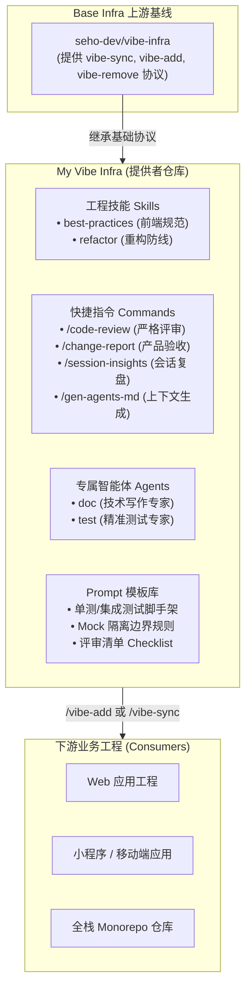

# My Vibe Infra

> **面向前端工程、代码质量、文档编排与系统测试的 AI 基础设施套件**
>
> **中文文档** | [English Documentation](README.md)

[](https://github.com/seho-dev/vibe-infra)
[](#)
[](https://github.com/seho-dev/my-vibe-infra/actions)
[](LICENSE)

---

## 概述

`my-vibe-infra` 是遵循 [vibe-infra](https://github.com/seho-dev/vibe-infra) 规范的 **AI 基础设施提供者仓库**（`role: "provider"`）。该仓库面向现代企业级软件研发场景，沉淀并分发可直接驱动 AI 编程助手（Claude Code、OpenCode、Antigravity、Cursor 等）的工程能力资产，包含领域技能（Skills）、快捷指令（Commands）、专业子智能体（Subagents）与实战测试/文档模板（Prompts）。



---

## 核心特性

### 1. 领域技能集（`skills/`）

在编写代码、架构重构与代码评审时自动或按需加载的深度工程规范约束：

| 技能名称 | 定位说明 | 核心模块与规则 |
| :--- | :--- | :--- |
| **`best-practices`** | 前端工程与代码质量规范。编写前端代码前**必须遵循的基线约束**。 | • **基础编码与风格**：强制参数规整（Normalize）、防御性兜底（Fallback）、Early Return 原则。<br/>• **组件与业务逻辑解耦**：严格分离 UI 展示层与状态逻辑层，杜绝“上帝组件”。<br/>• **状态管理与性能优化**：状态最小化原则，避免无意义的重渲染与隐式联动。<br/>• **自检清单**：提供组件设计自检清单与通用代码评审清单。 |
| **`refactor`** | 安全重构防护网。在迁移公共接口、改动状态流或调整模块切面时加载。 | • **锁定行为先于重构**：结构变更前必须补齐关键回归测试，严禁仅凭编译通过就大动结构。<br/>• **策略配置与运行时分离**：声明式配置严禁持有运行时实例或命令句柄。<br/>• **声明式优先于命令式**：同层级优先通过参数与响应式状态流转，避免黑盒抽象。<br/>• **彻底删除而非隐藏**：废弃逻辑彻底清理，严禁通过 Feature Flag 长期藏污纳垢。 |

---

### 2. 快捷指令（`commands/`）

标准化的工程流交互指令，消除重复 Prompt 编写成本：

| 指令 | 目标受众 | 核心职责 |
| :--- | :--- | :--- |
| **`/code-review`** | 研发人员 / Tech Lead | **严格、证据驱动的代码评审**。汲取 Linus Torvalds 的工程直觉，以正确性、回归风险、架构贴合度与长期可维护性为最高优先级，摒弃无意义的形式主义与表面文字挑刺。 |
| **`/change-report`** | 产品经理 / QA 质检人员 | **面向非技术受众的变更验收报告**。自动分析工作区 Diff，将代码变更“翻译”为无技术黑话的业务影响范围、用户可感知行为变化与明确的测试关注点。 |
| **`/session-insights`** | 研发团队 / 组织效能 | **跨工作树（Worktree）会话历史扫描与复盘**。分析研发历史中的认知摩擦、反复修改的痛点模块与常见失误，生成只读洞察报告，不修改任何业务文件。 |
| **`/gen-agents-md`** | AI Agent / 模块负责人 | **模块级局部上下文生成器**。根据组件或模块描述，生成轻量化的目录级 `AGENTS.md`，避免全局 Prompt 膨胀的同时确保局部规范生效。 |

---

### 3. 专属子智能体（`agents/`）

内置具备独立上下文与针对性系统指令的专用智能体配置：

- **`doc`（技术写作专家）**：
  - **职责**：编写用户反馈报告、评审反馈总结、系统技术文档与模块知识库。
  - **核心准则**：规范英文输出、最多 3 级标题、表格严谨对齐、完全去修饰词（No fluff writing）。
- **`test`（精准测试工程师）**：
  - **职责**：针对业务模块、纯函数、组件交互与跨模块协同生成完备的自动化测试。
  - **核心准则**：
    - **极简且具表达力**：写能守护核心业务契约的最小化测试用例。
    - **测试行为而非实现细节**：严禁断言纯视觉样式、DOM 嵌套层级或静态文案。
    - **只 Mock 外部边界**：仅隔离网络请求、时间、随机数与第三方重量级 SDK，严禁 Mock 正在被测的内部逻辑单元。
    - **零代码污染**：严禁为了测试便利而在业务代码中暴露冗余状态或逃生接口。

---

### 4. 规范模板库（`prompts/`）

提供与 Agent、Command 深度绑定的规范、模板与示例：

- `prompts/agents/test/`：组件测试、逻辑测试、工具函数测试与集成测试的标准化模板（TypeScript），以及 Mock 边界规则与评审 Checklist。
- `prompts/agents/doc/`：反馈报告与评审报告标准模板。
- `prompts/commands/gen-agents-md/`：`AGENTS.md` 生成规范与结构模板。

---

## 目录结构

```text
my-vibe-infra/
├── .github/
│   └── workflows/
│       └── release.yml             # 基于 Semantic Release 的自动化发版流
├── .opencode/                      # 本地 Host 工具生命周期命令
│   ├── commands/
│   │   ├── vibe-add.md             # /vibe-add 指令实现
│   │   ├── vibe-remove.md          # /vibe-remove 指令实现
│   │   └── vibe-sync.md            # /vibe-sync 指令实现
│   └── prompts/
│       └── shared-concepts.md      # vibe-infra 核心规范公理
├── agents/                         # 专属子智能体定义
│   ├── doc.md                      # 技术写作专家
│   └── test.md                     # 精准测试工程师
├── commands/                       # 快捷指令
│   ├── change-report.md            # 产品/QA 变更验收报告
│   ├── code-review.md              # 严格代码评审
│   ├── gen-agents-md.md            # 模块 AGENTS.md 生成器
│   └── session-insights.md         # 跨 Worktree 会话洞察
├── prompts/                        # 支撑指令与 Agent 的实战模板与规范
│   ├── agents/                     # 单测/文档模板与清单
│   └── commands/                   # 指令辅助参考
├── skills/                         # 领域工程技能
│   ├── best-practices/             # 前端工程最佳实践规范与样例
│   └── refactor/                   # 重构安全防线
├── vibe.json                       # Provider 规范清单（声明导出的资产）
└── vibe.lock                       # 依赖上游 Base 的极简语义锁
```

---

## 接入与消费指南

### 方式一：在已接入 vibe-infra 的工程中使用 `/vibe-add`

直接在终端或 AI 对话框中执行：

```bash
/vibe-add https://github.com/seho-dev/my-vibe-infra
```

AI 引擎将自动执行：
1. 依赖来源与 Prompt 内容的供应链安全审计；
2. 摄取本仓库对应 Tag 的 `README.md` 进行背景认知注入；
3. 将包含的 Skills、Commands、Prompts 语义融合到本地 AI 编程工具的原生目录中；
4. 登记 `vibe.json` 依赖项并在 `vibe.lock` 中锁定具体 Commit 与 Tag。

### 方式二：通过自然语言引导 AI 助手接入

在 Claude Code、OpenCode 或其他支持的 Agent 工具中发送以下提示词（**内置 Base Infra 依赖自愈检测**，即使在未接入基线的新项目中也能一键自动补全全部基础设施）：

```markdown
请按照 vibe-infra 规范，将 https://github.com/seho-dev/my-vibe-infra 作为基础设施依赖引入到当前工程中：

1. 【前置 Base Infra 依赖自愈】：
   检查当前工程是否已接入底层 Base Infra（判断根目录 vibe.json 中 infrastructures 是否包含 base，或 AI 原生目录是否存在 vibe-sync 等生命周期指令）。
   - 若未接入 Base Infra：请优先访问 https://github.com/seho-dev/vibe-infra，解析其最新稳定 Git Tag，阅读 Tag README 建立认知，将其核心指令（commands/vibe-add.md、vibe-sync.md、vibe-remove.md）与公理（prompts/shared-concepts.md）安装到当前工程的 AI 工具原生配置目录下，并在根目录创建/更新 vibe.json（role: "consumer"，base 声明为 version: "latest"）及 vibe.lock。
2. 【解析目标 Infra】：校验 https://github.com/seho-dev/my-vibe-infra 根目录是否存在合法的 vibe.json 清单，解析其最新的稳定 Git Tag。
3. 【认知背景注入】：摄取该 Tag 对应的 README.md 建立认知背景（仅作上下文记忆，不得落盘写入项目）。
4. 【供应链安全审计】：对引入的 commands/、skills/、prompts/ 进行供应链安全审计。
5. 【扁平化语义融合】：将工程技能（skills/）、业务指令（commands/）与规范模板（prompts/）扁平化语义融合到当前工程对应的 AI 工具原生配置目录下。
6. 【依赖清单与版本锁定】：在根目录 vibe.json 的 infrastructures 中注册当前依赖（"seho-vibe-infra"，version: "latest"），并在 vibe.lock 记录锁定的 tag 和 commit SHA。
7. 【结果输出】：输出完整的接入结果报告（包含已补齐的 Base 指令与已注入的工程能力）。
```

### 方式三：声明式清单配置（`vibe.json`）

在业务消费端工程根目录的 `vibe.json` 中声明：

```json
{
  "$schema": "https://raw.githubusercontent.com/seho-dev/vibe-infra/main/schema.json",
  "role": "consumer",
  "infrastructures": {
    "base": {
      "url": "https://github.com/seho-dev/vibe-infra",
      "version": "latest"
    },
    "seho-vibe-infra": {
      "url": "https://github.com/seho-dev/my-vibe-infra",
      "version": "latest"
    }
  }
}
```

随后通过 `/vibe-sync` 指令完成资产同步。

---

## 提供者维护与开发

作为规范提供者仓库（`role: "provider"`），本项目直接在根目录维护各模块资产。

### 同步上游 Base Infra 更新

当基础规范库 `seho-dev/vibe-infra` 发布新版本时，在当前仓库执行：

```bash
/vibe-sync
```

Agent 会自动时序遍历中间版本的 Release Notes 与 Changelog，进行供应链安全审查，并将更新融合至根目录资产，同时保障本仓库的本地定制内容不受破坏。

### 自动化发布流程

仓库配置了基于 GitHub Actions 的 [semantic-release](https://github.com/semantic-release/semantic-release) 自动发版流程（见 `.github/workflows/release.yml`）。当合并包含符合 Conventional Commits 规范（`feat:`, `fix:`, `perf:` 等）的提交至 `main` 分支时，将自动分析版本号、生成 Release Notes 并打上对应的 Git Tag。

---

## 规范公理与协议

本仓库严格遵循 [prompts/shared-concepts.md](.opencode/prompts/shared-concepts.md) 中定义的工程公理：
- **认知注入边界**：Tagged README 仅供 Agent 执行期记忆加载，严禁落盘拷贝至下游工程。
- **扁平化语义融合**：杜绝多层深层嵌套，同名文件以业务意图优先进行智能合并。
- **供应链安全前置**：严禁隐式凭据提取、未经授权的网络外发或危险 Shell 执行。

---

## 开源协议

MIT © [seho](https://github.com/seho-dev)
